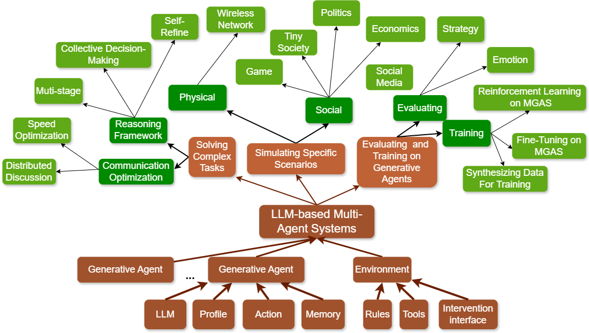

# A Survey on LLM-based Multi-Agent System:   Recent Advances and New Frontiers in Application

This repository contains the figure and data related to the paper "**A Survey on LLM-based Multi-Agent System: Recent Advances and New Frontiers in Application**." The paper provides a survey on the recent advancements and future directions in multi-agent systems based on large language models (LLMs). It covers both the theoretical and practical aspects, including relevant LLM-based Multi-Agent System (LLM-MAS) architecture, applications, challenges, and potential directions. For more details, refer to the
[paper](https://arxiv.org/abs/2412.17481).

<figure id="fig:LLM-MAS_framework">
  
  <figcaption>Figure 1: Overview of the application framework and relationship of LLM-MAS, generative agent, and LLM. Dashed-bordered right-angled rectangles represent content aligned with previous surveys, while rounded rectangles indicate original contributions introduced in this study.</figcaption>
</figure>

this survey has the following distinctive contributions:

- A Taxonomy focusing on application of LLM-MAS: we introduce a more recent taxonomy (taxonomy and difference are shown in [Figure 1](#fig:LLM-MAS_framework)) based on the purpose of the application of LLM-MAS.
- More Resources: we analyze open-source frameworks and research works with benchmarks or datasets to facilitate the research community.
- Challenges and Future: we discuss the challenges in LLM-MAS , and shed light on future research.

## Table of Contents

- [A Survey on LLM-based Multi-Agent System:  Recent Advances and New Frontiers in Application](#a-survey-on-llm-based-multi-agent-system--recent-advances-and-new-frontiers-in-application)
  - [Table of Contents](#table-of-contents)
  - [LLM-MAS for Solving Complex Tasks](#llm-mas-for-solving-complex-tasks)
    - [Reasoning Framework](#reasoning-framework)
    - [Communication Optimization](#communication-optimization)
  - [LLM-MAS for Simulating Specific Scenarios](#llm-mas-for-simulating-specific-scenarios)
  - [LLM-MAS for Evaluating Generative Agents](#llm-mas-for-evaluating-generative-agents)
  - [Resources](#resources)

## LLM-MAS for Solving Complex Tasks

In most scenarios in reality, completing a task requires multiple roles, multiple steps, and so on. This is difficult for a single agent, but multiple agents working together will be well suited to this task. Further, each of these agents can be trained  independently. Compared with a single agent, LLM-MAS can achieve better results. That is, the multi-agent collaboration will improve the overall performance. For recent works, we summarize two aspects, reasoning framework and communication optimization.

### Reasoning Framework

We summarize three aspects by the pipeline of reasoning, including:

- multi-stage framework
- collective decision making
- self-refine framework

Just as its name implies, multi-stage framework refers to a pipeline that agents act as serial problem solvers at different stages, while collective decision making refers that different agents vote or debate for one goal. Self-refine framework refers that one agent iterates itself in the loop.

### Communication Optimization

We summarize two aspects in Communication Optimization, including:

- speed optimization
- distribute discuss

Speed optimization refers that researchers try to speed up the communication of agents, while distribute discuss refers that agents try to solve tasks without enough information. Agents need to communicate with each other to achieve their goal.

## LLM-MAS for Simulating Specific Scenarios

This section will illustrate the application for LLM-MAS in simulation. Researchers apply agents to simulate a certain scenario to study its impact on a specific subject like social science. On the one hand, compared with rule-based methods, generative agents with natural  communication can be more intuitive for humans. On the other hand, environment determines the properties of the simulation, which is the core of the entire simulation. We summarize main domain where researchers apply simulation, including:

- Game
- Social Media
- Tiny Society
- Politics
- Economics
- Wireless Framework

## LLM-MAS for Evaluating Generative Agents

With LLM prevailing in the community, how to evaluate the ability of LLM is an open question. Existing evaluation methods suffer from the following shortcomings:

- constrained evaluation abilities
- vulnerable benchmarks
- unobjective metrics.

The complexity and diversity of LLM-MAS have indicated that LLM-MAS can evaluate LLM. Researchers mainly evaluate strategic and emotional ability of generative agent.

Similarly, LLM-MAS can also be used in training generative agents. We summarize three aspects of training:

- Supervised Fine-Tuning (SFT)
- Reinforcement Learning (RL)
- Synthesizing data for training.

## Resources

This repository includes all the necessary code to reproduce the experiments in the paper. The code is organized as follows:

- `/data`: Datasets used in the experiments.
- `/figures`: Figures and diagrams used in the paper.

For foreigner in this field, please see table 1, table 2 and table 3 for open-source code and benchmark or datasets in [paper](https://arxiv.org/abs/2412.17481).

Our collected papers are published in [this link](https://south-colony-f37.notion.site/167fe4b85d7480148386f2d100f5617f?v=167fe4b85d74811e9db9000ceb088ea4&pvs=4)
